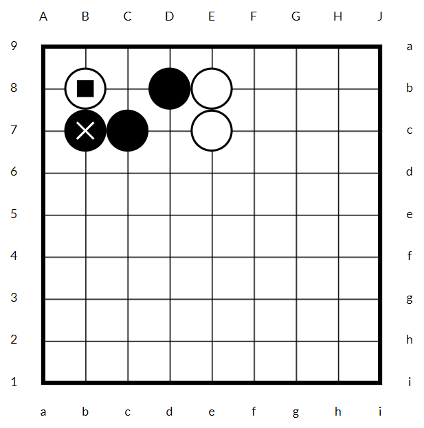

# Build

1. `npm install`
1. `npm run build`

# API

```js
const gb = SVGGobanElement.create(9); // creates a 9x9 board

document.body.appendChild(gb);

gb.AW.add(1, 1); // add a white stone
gb.SQ.add(1, 1); // add a little square on top of it
gb.AW.add(4, 1); // 0-based coords: x=4 (left to right), y=1 (top to bottom)
gb.AW.add(4, 2);
gb.AB.add(1, 3); // add a black stone
gb.MA.add(1, 3); // mark it with a little cross
gb.AB.add(2, 3);
gb.AB.add(3, 2);
```

This is how it looks:


